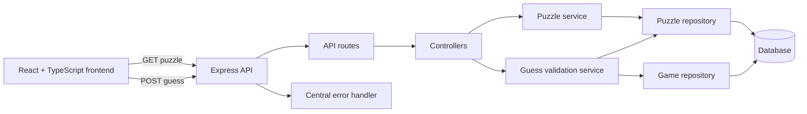
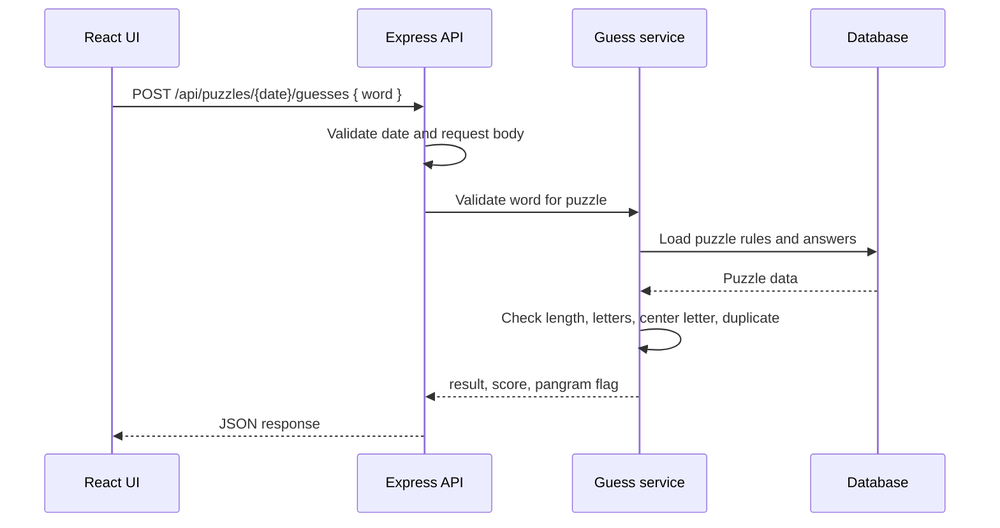

# React + TypeScript + Vite

This template provides a minimal setup to get React working in Vite with HMR and some ESLint rules.

Currently, two official plugins are available:

- [@vitejs/plugin-react](https://github.com/vitejs/vite-plugin-react/blob/main/packages/plugin-react) uses [Oxc](https://oxc.rs)
- [@vitejs/plugin-react-swc](https://github.com/vitejs/vite-plugin-react/blob/main/packages/plugin-react-swc) uses [SWC](https://swc.rs/)

# Spelling Bee

Spelling Bee is a browser word game inspired by the daily seven-letter spelling puzzle. Players form words from a honeycomb of letters. Every word must use the center letter, contain at least four letters, and use only the seven letters in the current puzzle.

The project is being built as a React and TypeScript frontend first, with a Node.js and Express backend planned for puzzle delivery, answer validation, and player progress.

## Features

### Currently implemented

- Loads a daily puzzle from `public/api/data.json`.
- Displays the puzzle date and editor.
- Renders a center letter and six outer letters in a honeycomb layout.
- Builds a guess by selecting letters.
- Deletes the last selected letter, shuffles the outer letters, and submits a guess.
- Checks guesses against the local answer list.
- Tracks correct guesses and calculates a score.
- Shows or hides the list of found words.

### Planned features

- Enforce minimum word length and center-letter rules in one validation service.
- Add clear feedback for invalid, duplicate, valid, and pangram guesses.
- Support daily puzzle history and puzzle selection by date.
- Persist player progress and scores.
- Add keyboard input, responsive styling, accessibility improvements, and automated tests.
- Replace the static JSON file with an Express API.

## Frontend Architecture

The current frontend uses a small component-based structure:

```text
src/
├── App.tsx                 # Page state, puzzle loading, and game actions
├── main.tsx                # React application entry point
├── App.css                 # App and component styles
├── index.css               # Global styles
└── components/
  ├── Header.tsx          # Puzzle title, date, and editor
  ├── Honeycomb.tsx       # Letter board and game controls
  ├── Letter.tsx          # Individual clickable letter
  ├── Guess.tsx           # Current word being formed
  ├── CorrectGuesses.tsx  # Found-word list
  └── Score.tsx           # Score calculation and display
```

`App.tsx` currently owns the game state. It fetches the puzzle, passes letter data down to presentational components, and handles adding, deleting, submitting, and recording guesses. When the backend is introduced, the fetch URL and answer-checking flow should move behind a small API client so components do not know whether data comes from JSON or Express.

## Tools And Technologies

- **React 19** for the interactive user interface.
- **TypeScript** for typed puzzle data and component props.
- **Vite** for development server, HMR, and production builds.
- **ESLint** for code quality and consistency.
- **pnpm** for dependency installation and scripts.
- **Node.js and Express** for the planned backend API.
- **JSON now, database later** for puzzle and progress storage.
- **Mermaid** for the architecture diagrams in this document.

## Backend Requirements

The backend should be responsible for data and rules that should not be trusted to the browser:

1. Serve today’s puzzle and optionally yesterday’s or another requested date.
2. Validate submitted words against the puzzle’s allowed letters and answer list.
3. Calculate the score and identify pangrams on the server.
4. Prevent duplicate submissions and return a predictable result to the client.
5. Store puzzles, answers, and optional player sessions in a database.
6. Validate request data, handle errors consistently, and configure CORS for the Vite frontend.

Suggested API endpoints:

| Method | Endpoint                     | Purpose                                                      |
| ------ | ---------------------------- | ------------------------------------------------------------ |
| `GET`  | `/api/puzzles/today`         | Return today’s puzzle without exposing unnecessary metadata. |
| `GET`  | `/api/puzzles/:date`         | Return a puzzle for a specific ISO date.                     |
| `POST` | `/api/puzzles/:date/guesses` | Validate one submitted word and return its score/result.     |
| `GET`  | `/api/games/:gameId`         | Return saved progress for a game session.                    |
| `PUT`  | `/api/games/:gameId`         | Save found words and the current score.                      |
| `GET`  | `/api/health`                | Check that the backend is running.                           |

## Proposed Backend Architecture

The Express server should keep routing, game rules, and storage separate. The frontend sends a request, the controller coordinates the work, the service applies the spelling rules, and the repository reads or writes the database.

For the full backend design, API contract, responsibilities, and implementation order, see [docs/backend-architecture.md](docs/backend-architecture.md).



### Suggested backend structure

```text
server/
├── src/
│   ├── app.ts                 # Express app and middleware
│   ├── server.ts              # HTTP server startup
│   ├── routes/
│   │   ├── puzzle.routes.ts
│   │   ├── guess.routes.ts
│   │   └── game.routes.ts
│   ├── controllers/           # Request and response handling
│   ├── services/              # Puzzle and guess business rules
│   ├── repositories/          # Database access
│   ├── middleware/            # Validation, errors, and CORS
│   └── types/                 # Shared backend types
├── package.json
└── .env.example
```

### Guess request flow



## Getting Started

Install dependencies:

```bash
pnpm install
```

Start the frontend development server:

```bash
pnpm dev
```

Run checks and create a production build:

```bash
pnpm lint
pnpm build
```

The Express backend is not implemented yet. The first backend milestone should add `/api/health` and `GET /api/puzzles/today`, then update the frontend to use the API before moving answer validation and progress persistence to the server.
