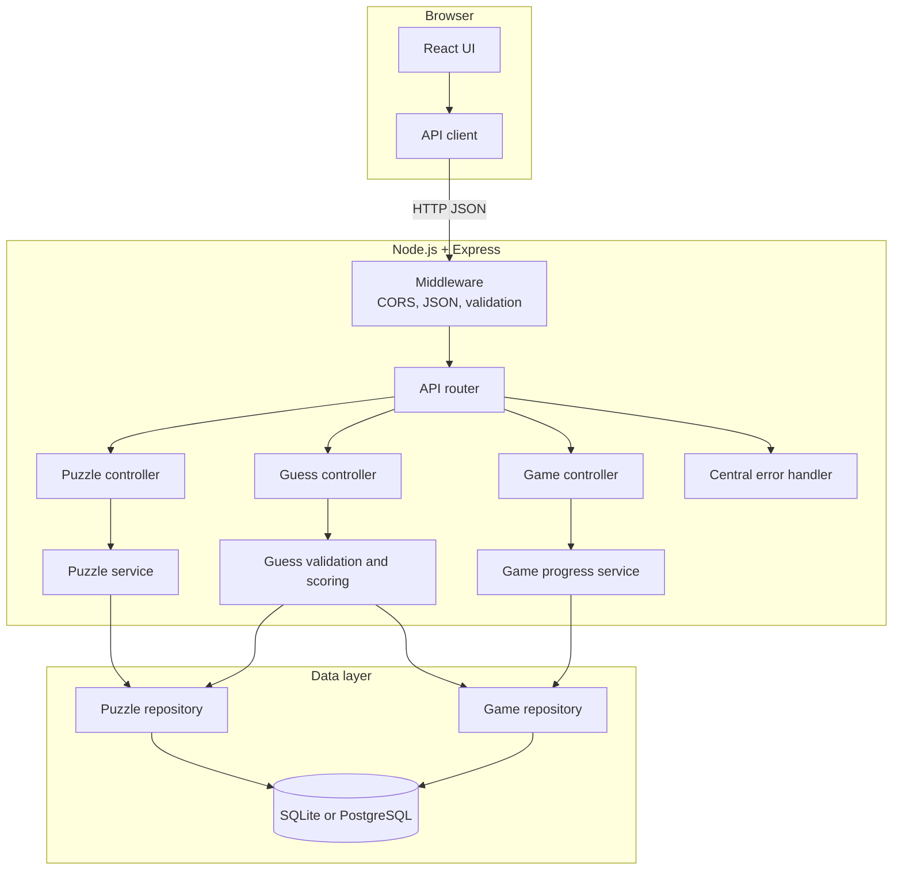
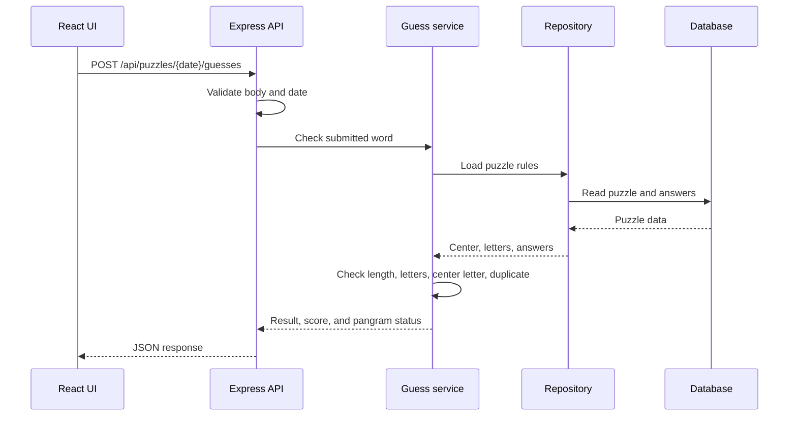

# Backend Architecture

This document describes the planned Node.js and Express backend for Spelling Bee. The backend will own puzzle data, guess validation, scoring, and optional saved game progress.

## System Diagram



## Request Flow



## Responsibilities

| Layer         | Responsibility                                                               |
| ------------- | ---------------------------------------------------------------------------- |
| React UI      | Display the puzzle, collect letters, and render server results.              |
| API client    | Keep HTTP details out of React components.                                   |
| Middleware    | Parse JSON, configure CORS, validate input, and handle authentication later. |
| Routes        | Map HTTP methods and URLs to controllers.                                    |
| Controllers   | Read requests and return consistent HTTP responses.                          |
| Services      | Apply puzzle rules, calculate scores, and coordinate repositories.           |
| Repositories  | Read and write puzzle and game data.                                         |
| Database      | Persist puzzles, answers, and optional player progress.                      |
| Error handler | Convert expected and unexpected errors into safe JSON responses.             |

## API Contract

### Get today's puzzle

```http
GET /api/puzzles/today
```

```json
{
  "date": "2024-02-13",
  "centerLetter": "b",
  "outerLetters": ["a", "c", "e", "i", "l", "p"]
}
```

The answer list should not be sent to the browser once validation is handled by the server.

### Submit a guess

```http
POST /api/puzzles/2024-02-13/guesses
Content-Type: application/json

{
  "word": "applicable",
  "gameId": "optional-session-id"
}
```

Example response:

```json
{
  "word": "applicable",
  "result": "correct",
  "score": 12,
  "isPangram": true
}
```

Possible result values are `correct`, `duplicate`, `too-short`, `invalid-letter`, `missing-center`, and `not-found`.

## Suggested Server Structure

```text
server/
└── src/
    ├── app.ts
    ├── server.ts
    ├── routes/
    │   ├── puzzle.routes.ts
    │   ├── guess.routes.ts
    │   └── game.routes.ts
    ├── controllers/
    ├── services/
    ├── repositories/
    ├── middleware/
    └── types/
```

## Build Order

1. Create an Express app with `/api/health`.
2. Add `GET /api/puzzles/today` using the existing JSON data.
3. Add a guess-validation service with unit tests.
4. Add `POST /api/puzzles/:date/guesses` and return consistent results.
5. Move puzzle data into SQLite or PostgreSQL.
6. Add game sessions and saved progress.
7. Update the React API client to use the Express server.
